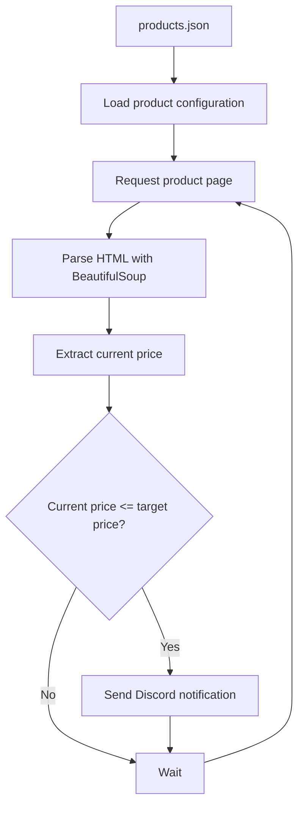

# Price Alert

A Python-based price monitoring tool that periodically checks product prices on online stores and sends a Discord notification when a product reaches or falls below a configured target price.

The project currently supports **Alternate.de** and is primarily a learning and portfolio project focused on Python, web scraping, automation, HTTP requests, JSON data handling, and notifications.

## Features

* Monitor product prices automatically
* Configure products and target prices using `products.json`
* Scrape product prices from **Alternate.de**
* Compare the current price with a configured target price
* Send notifications through a Discord webhook
* Store the Discord webhook URL separately from the product configuration
* Periodically repeat the price check
* Configurable polling interval depending on the current price state

## How It Works

The application follows a simple workflow:



The monitoring process runs continuously and periodically checks the configured products.

## Project Structure

```text
price-alert/
├── src/
│   ├── main.py
│   └── scraper.py
├── products.json
├── webhookurl.txt
├── requirements.txt
├── .gitignore
└── README.md
```

### `main.py`

Controls the main monitoring loop and determines when the next price check should be performed.

### `scraper.py`

Contains the main scraping and comparison logic:

* Loading product data
* Requesting product pages
* Parsing HTML
* Extracting prices
* Comparing prices with target prices
* Sending Discord notifications

### `products.json`

Contains the products that should be monitored.

Example:

```json
{
  "products": [
    {
      "initial": 1,
      "name": "Example Product",
      "url": "https://www.alternate.de/...",
      "target_price": 1500
    }
  ]
}
```

### `webhookurl.txt`

Contains the Discord webhook URL used to send notifications.

**Do not commit this file to a public repository.**

The webhook URL should be treated as a secret.

## Requirements

* Python 3
* `requests`
* `beautifulsoup4`

Dependencies are listed in `requirements.txt`.

## Installation

Clone the repository:

```bash
git clone <repository-url>
cd price-alert
```

Install the required Python packages:

```bash
pip install -r requirements.txt
```

Create a `webhookurl.txt` file in the project root and add your Discord webhook URL.

Configure the products you want to monitor in `products.json`.

## Usage

Start the monitoring application with:

```bash
python src/main.py
```

The application will periodically check the configured products and print information about each monitoring cycle to the console.

If a product reaches or falls below the configured target price, a Discord notification is sent.

## Current Limitations

The project is currently designed specifically for **Alternate.de**.

Current limitations include:

* Only Alternate.de is supported
* The scraper depends on the website's current HTML structure
* The application currently runs continuously in a single process
* There is no persistent database for price history
* Product configuration is stored in JSON
* Error handling and retry logic are still being improved
* Rate-limit handling is currently limited
* Discord is currently the only notification method

## Future Improvements

Possible future improvements include:

* Support for additional online stores
* Persistent price history
* Improved error handling and retry mechanisms
* Better rate-limit handling
* Additional notification methods
* Logging
* Automated tests
* Docker support

## Learning Goals

This project was created as a practical way to improve my understanding of Python and web-based systems.

While developing it, I worked with:

* Python
* HTTP requests
* HTML parsing
* Web scraping
* JSON
* File handling
* Functions and modules
* Error handling
* Automation
* Webhooks
* Git and GitHub


# Disclaimer

This project is intended for educational and research purposes.

The example implementation is designed to perform low-frequency requests against publicly accessible product pages. When using or modifying this software, users are responsible for complying with the terms of service, robots.txt directives, rate limits, applicable laws, and other policies of the websites they access.

Do not use this project to generate excessive traffic, bypass technical protections, circumvent access restrictions, or otherwise interfere with the normal operation of any website.
This script just retrieve public accessible sites, please read the robots.txt before using it.

The author does not encourage or endorse unauthorized access, abuse, or disruption of third-party services.

This disclaimer does not grant permission to access or scrape any particular website.